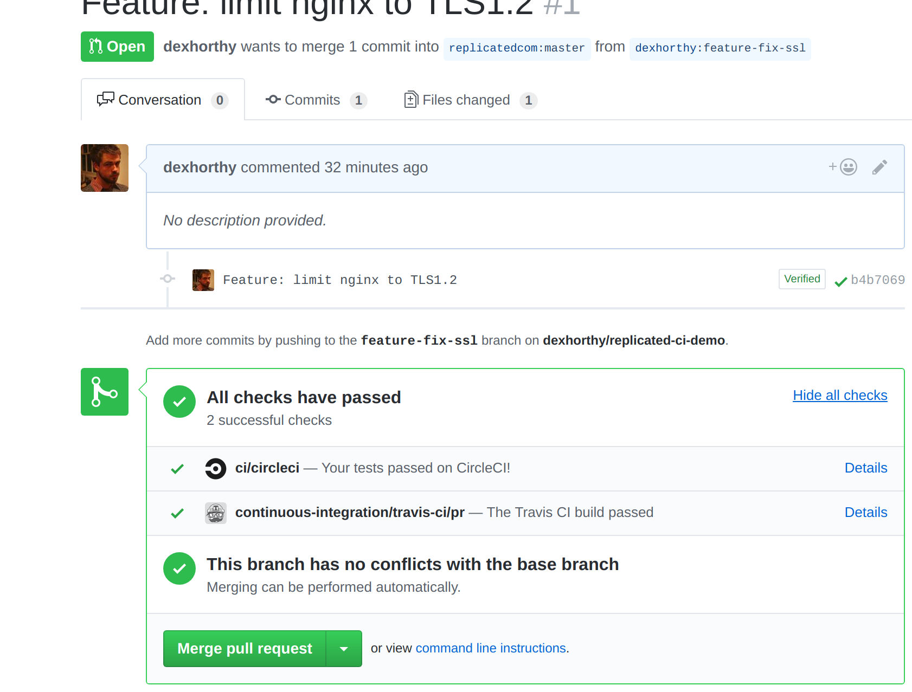
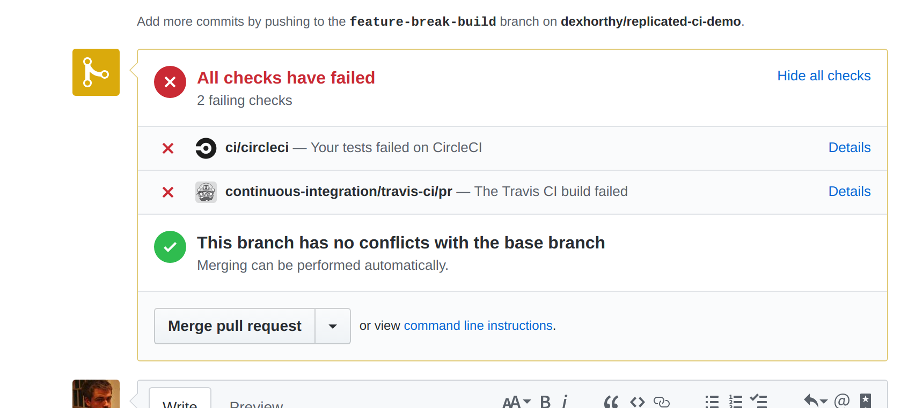
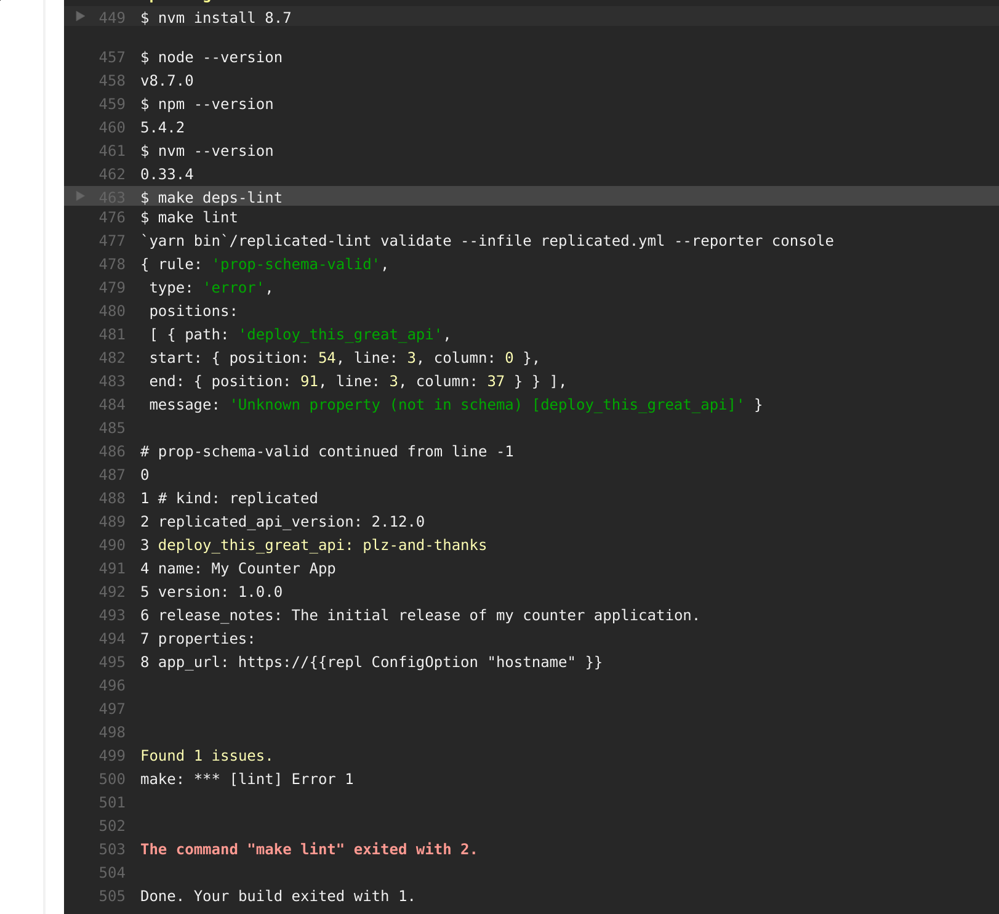

Replicated CI Demo
==================

Example project showcasing how to combine several Replicated tools in order to manage
Replicated YAML using a git repository.

### Pipeline Overview

The project includes CI configs for [Travis CI](https://travis-ci.org) and [CircleCI](https://circleci.com). Both configs will:

**On pull requests**:

- Install dependencies
- Lint yaml for syntax and logic errors

**On merges to the github `master` branch**:

- Install dependencies
- Test yaml for syntax and logic errors
- Create a new release on the `Unstable` channel in Replicated

**On merges to the github `release` branch**:

- Install dependencies
- Test yaml for syntax and logic errors
- Create a new release on the `Stable` channel in Replicated

### Make Commands

`make deps`    -- Install [replicated yaml linter](https://github.com/replicatedhq/replicated-lint) and [replicated vendor cli](https://github.com/replicatedhq/replicated)

`make lint`    -- Lint the yaml at `replicated.yml`

`make release` -- Deploy and promote a new release to the replicated vendor portal. By default it will be promoted to the `Unstable` channel, but can be overriden by the `channel` make variable:

```sh
make release channel="Beta"
```

We use this to deploy releases to other channels.


### Setup

You'll need to set the following env vars to run the project:

`REPLICATED_APP` - either an app slug or app ID

`REPLICATED_API_TOKEN` - a token for the [Replicated  Vendor API](https://help.staging.replicated.com/categories/vendor-api/)

If you need help finding the values for these, check out the guide for [Finding Your API Token and App ID](https://help.staging.replicated.com/docs/kb/developer-resources/finding-your-api-token-and-app-id/)


### Build Prequisites

To enable linting, you'll need to be using a build environment that provides a
reasonably recent version of nodejs. We use 8.7.0 in this example, see `circle.yml`
and `.travis.yml` for examples on how to set this up for [Travis CI](https://travis-ci.org) and [CircleCI](https://circleci.com)

### Pull Requests

Repo includes two examples of using CI to test pull requests. Travis will test PRs from forks automatically, but CircleCI requires enabling building for the fork.

#### Success

There's a passing pull request at https://github.com/replicatedhq/replicated-ci-demo/pull/1. It has all its checks passing:




#### Failure

There's a failing pull request at https://github.com/replicatedhq/replicated-ci-demo/pull/2. It has checks failing:




The travis build shows the failure in the build log:



We can even use replicated-lint's JUnit XML reporter to integrate with Circle's test report parsing:


